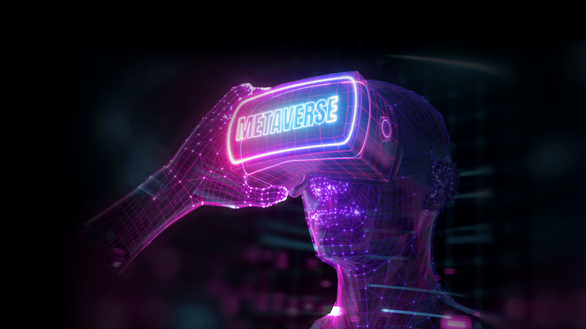

I’ve sat down with colleagues to talk about crypto and NFT, to dissect the concept of Metaverse, its future development and potential downside risks.

> This piece initially was posted on [Devexperts blog][0]

## Fiat → Crypto → Metaverse
Cryptocurrencies offer a greater set of advantages over fiat currencies. They’re safer and far less strictly regulated. They also have other advantages that made them so popular, like:

- **Fraud-resistance.** Since cryptocurrencies are digital and cannot be revered arbitrarily by the sender, they’re essentially safe from fraud and counterfeiting.
Identity theft protection. Crypto allows the user to send exactly what they want to the seller without any other information. If we compare this with the credit card payment mechanism, a seller would have complete access to your card and enough time to forge it. On top of that, our banks also store our private data, which can be leaked / stored.
- **Volatility.** Yep, that’s right, volatility. Cryptocurrencies are notorious for its volatility, with prices fluctuating massively from second to second. While high volatility can turn some investors away, it can be desirable to short-term traders who can make a profit from longing or shorting the market whether the price goes up or down. Which has helped boost crypto markets 10x in the past years.
- **Interchangeability.** It’s easier than ever to convert fiat into crypto and vice versa. Thus, you don’t need to store money in one basket (bank and card). In a matter of seconds, you can convert and withdraw your crypto assets into any fiat currency.

The Metaverse is like a continuation of crypto in this sense. You can invest in the Metaverse by buying NFTs from marketplaces like Opensea or Rarible. Or you could buy cryptocurrencies from projects set to be at the forefront of the Metaverse, such as Axie Infinity. And those assets can still easily be sold/converted to crypto/fiat currencies.

## NFT Values
NFTs are a completely novel asset class. And the underlying value of NFTs is enriched by a number of important variables, from ownership, identity, scarcity, aesthetics, community, technology, and utility. Each value is important in its own right and serves to increase the desire and value of a certain NFT.

1. **Ownership, Identity, and Authenticity**  
By design, NFTs can’t be replicated or copied due to the fact that they are stored on the blockchain, a web of public ledgers where both the provenance and transactions are tracked. Subsequently, anyone can find out things like, who owned the NFT first, how much it was purchased and sold for, as well as when it was first minted. As a result, we can quite easily determine what is authentic, and what is fake, and thereby we can also attribute value properly.

2. **Membership and Presence**  
It is not just the provenance that serves to create value for NFTs, membership is just as important. Humans are cultural, tribal species, and have a desire to communicate. Community is a concept that is innate within all of us, something that every person yearns for, or is a part of in some form. It used to be in the real world, like let’s say your favorite sports team. But now, it may soon be online, digitally, in the form of metaverse.  
NFTs are one tool of fostering community, and many NFTs serve as membership tokens. NFTs provide us with a means of recording which members of the community own the particular NFT. For example, the most prominent European football clubs have their tokens that not only serve as proof of membership, and also allow holders to be part of the decision making within the community. Sports/Art celebrities create their NFT collections that are immediately sold out for millions of $.  
NFTs can also provide you with an exclusive ticket into a specific community and/or event, whereby holders have the chance to enter the ecosystem and benefit from the community that they are in, socially and economically. Someone without the NFT wouldn’t have the same access. They also wouldn’t have the same ability to network, build their brand, and profit from the collection.

3. **Rarity and Uniqueness**  
NFTs are somewhat like traditional pieces of art. Value can be arbitrary, fully depending on one’s desire and ability to pay the premium. Moreover, some pieces may suddenly gain value without any evident reason whatsoever.

## NFT Trends
1. **Utility**  
When NFTs first came into fruition, the entire focus of value was on the art. But, this has significantly shifted in recent months. NFTs that have gained the most traction have offered utility through airdrops, real-life events that can only be accessed via the NFT, access to the metaverse, governance through DAOs (decentralized autonomous organization), or in other words, pretty much anything can be presented as an NFT nowadays.

2. **Environmental Impact**  
Minting NFTs has a serious impact on the environment as NFTs primarily use an Ethereum-powered proof-of-work approach that requires heavy computations. Stats show that Ethereum’s power consumption is as much as Hungary and Qatar. However, Ethereum just finished the merger and transition to a proof-of-stake approach which is expected to reduce energy usage by more than 99%.

3. **Gaming and Metaverse**  
The most popular NFT categories have historically been collectibles and utility pieces. Recently though, gaming and metaverse have been gaining a lot of momentum. The technology enables players to create, sell, and trade objects in NFT form in a shared digital realm. And they can even transfer them through the Metaverse.

Such NFTs unlock additional cosmetic in-game/metaverse value and also enable play-to-earn model games, where some players can even make a living from them.

[0]: https://devexperts.com/blog/metaverse-perspectives-and-legal-issues/

## Metaverse Regulation
The Metaverse concept is fascinating, but it can be dangerous. It’s not the technology that’s dangerous, but the fact that powerful corporations will be able to mediate all aspects of our lives, selling access to our daily experiences to the highest bidder. We already have it in today’s day and age with social media, websites, phones, and smart devices tracking and collecting all possible private data.

In the Metaverse, this has a real possibility to get much worse. The technology will not just track where you click, but where you go, what you do, who you’re with, what you look at, even how long your gaze lingers. The platforms will also track your facial expressions, vocal inflections, and vital signs (as captured by your trusty smart-watch and soon, earbuds), while AI algorithms use this data to predict your emotional state.

This means companies controlling the Metaverse will not just know how you act, but how you react, profiling your responses at the deepest level. Of course, the danger here isn’t in merely tracking those things, but rather, that these companies can easily use this data to manipulate our wants and needs, influencing what we buy and what we believe in.

So, how do we fix and regulate the Metaverse?

1. Implementing stricter data privacy regulation and limits on the allowed tracking
2. Shifting from ad-based to subscription-based models
3. Creating decentralized platforms controlled by users rather than corporate providers
And don’t forget the offensive/abusive behavior in metaverses. Should violation yield just a ban from a particular metaverse, or translate into real-world prosecution too?

## Alternative Metaverse Types
All major tech companies like Google, Microsoft, Apple, and Meta are already in Metaverse business and development. We’ll very soon see how it all pans out, but we can speculate that, more likely than not, they’ll be trying to capture even more of users’ time (subsequently data and money) in their ecosystems and smooth the transitions between devices, platforms, games, and sites. These are big players who are set up for market domination by default.

However, like we discussed before, these giants are tracking all your data in order to monetize it somehow. Thus, some alternatives have always had a non-mainstream movement. One of that kind right now is Decentraland—“the first-ever virtual world owned by its users”. It is controlled via the DAO, which owns the most important smart contracts and assets of Decentraland—the LAND Contract, the Estates Contract, Wearables, Content Servers, and the Marketplace. Through the DAO, users are in control of the policies created to determine how the world behaves. For example, the kinds of wearable items allowed (or disallowed) after the DAO launch, moderation of content, LAND policy and auctions, among others.

## What’s Next
The success of NFTs is the underlying technology that enables DeFi mechanisms and provides easy means of proving ownership, authenticity, and identity. This is a very young asset class, thus it’s volatile. But that volatility actually helps build up hype around NFTs even more, and the fact that celebrities view it as a legal way to monetize their fame creates a snowball effect.

Something is already here with NFTs, like buying and selling art pieces and proving ownership, authenticity, and identity. But the future use cases of NFTs could be virtually endless. The  general public is ready to jump on a lot of things, like music/video streaming NFTs, metaverse gaming/celebrities communities. Ethereum launched ENS—Ethereum Name Service. The most common use of an ENS domain is to use it as a replacement for those complex, 42-character crypto wallet addresses we all have, so probably one day we’ll all be referred to, not as John Doe, but **JohnDoe.eth**.